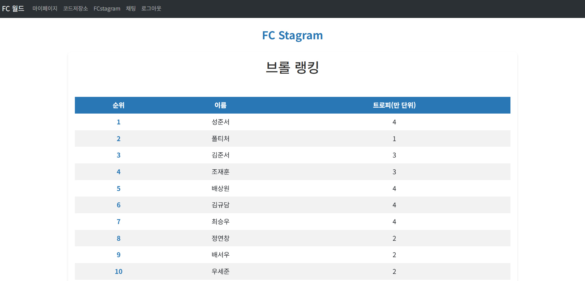
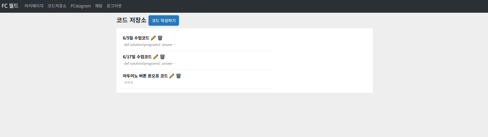
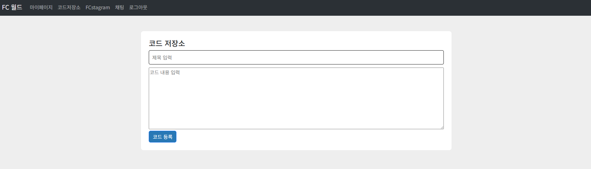
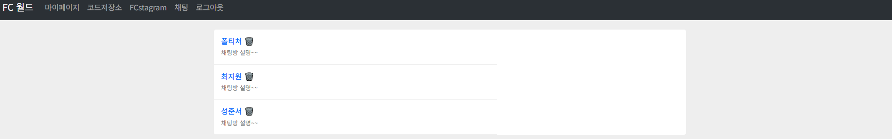
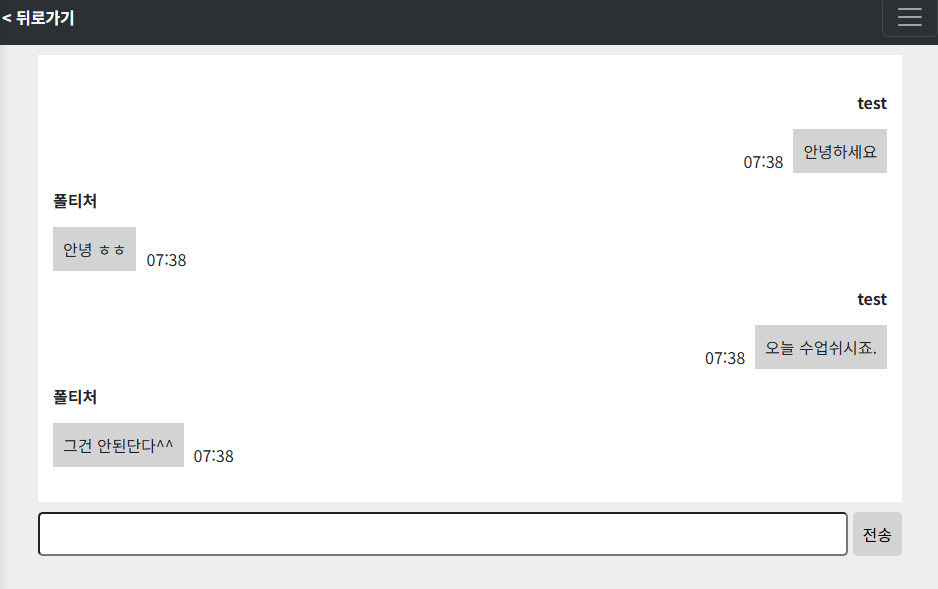

---
# FCWorld

학원 수강생들을 위한 전용 커뮤니티 웹사이트입니다.  
글과 사진을 업로드하거나 실시간 채팅을 통해 소통할 수 있으며, 수업 내용을 저장하는 기능도 포함되어 있습니다.

## 🔧 사용 기술

- Node.js (Express)
- MongoDB
- Socket.IO (WebSocket)
- EJS 템플릿 엔진
- Multer (파일 업로드)
- Raspberry Pi 서버 구축

## 📌 주요 기능

- SNS 스타일 게시판: 글/사진 업로드
- 수업 필기 저장 기능
- 실시간 채팅 시스템
- 관리자 공지 및 관리 기능

## 🖥️ 실행 방법

1. 저장소를 클론한 후 패키지를 설치합니다:

```bash
npm install
```
2. .env 파일에 MongoDB 주소 등 환경 변수 입력.
3. 다음 명령어로 서버 실행:
```bash
node server.js
```
4. 웹 브라우저에서 http://localhost:3000 접속.
5. 아래 제공되는 테스트 아이디와 비밀번호로 로그인.

## 실제 사이트 주소
- 주소: https://fcworld.firstcoding.kr
- 테스트ID : test
- password : 12341234

## 🖼️ 스크린샷
## 메인페이지


## SNS 페이지


## 코드저장소 페이지


## 코드 작성 페이지


## 채팅방 리스트 페이지


## 채팅 페이지

